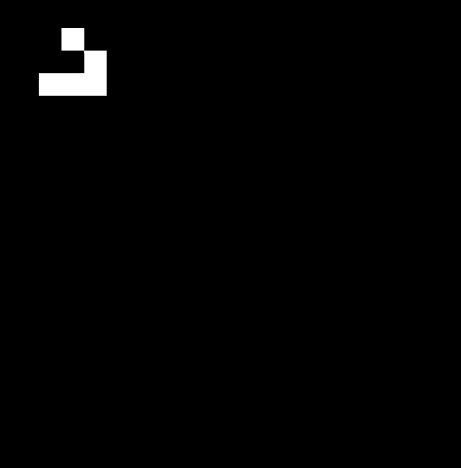
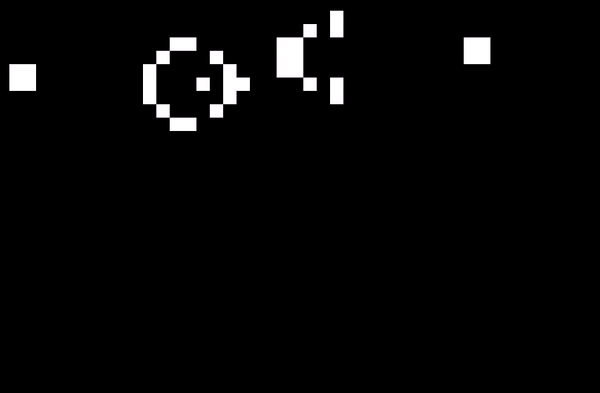

**Game of life - Conway**

This is an implementation of the game of life of Conway, it uses SFML as graphical lib.

You can change the main settings (cells and window size and the speed) in the config file.
To init a pattern, draw it with left clicks and then tap enter, if you want to delete a cell right click on it (only when you haven't started the process).

On a technical point of view, the map is represented as a simple array instead of a 2d-array.

Pulsar (period 3):

Glider:

Light spaceship:

Gosper slider gun:
